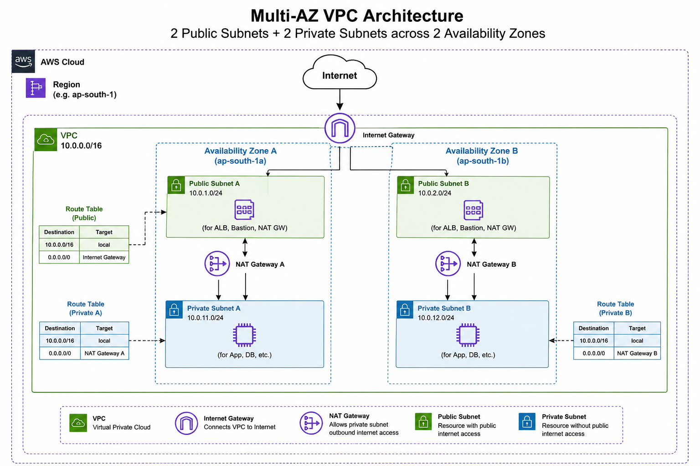

## Architecture

This project provisions a Multi-AZ VPC with 2 public and 2 private subnets across 2 Availability Zones.

- **Public Subnets**: Host ALB, Bastion, NAT Gateway
- **Private Subnets**: Host App/DB resources
- **NAT Gateway**: Per-AZ, for private subnet outbound internet access
- **Route Tables**: Separate public and per-AZ private route tables
